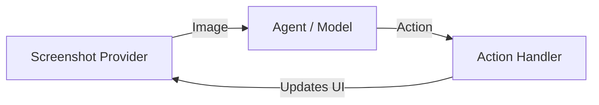

# The Core Loop

At the heart of every OpenAGI agent is a continuous cycle of perceiving the UI, deciding on an action, and executing it. This loop repeats until the task is complete.

## How it Works



In code, this loop is conceptually very simple:

```python
# 1. Perceive: Capture the current state of the screen
image = await screenshot_provider()

# 2. Think: The model analyzes the image and decides what to do
step = await agent.step(image)

# 3. Act: The handler executes the command (e.g., click, type)
await action_handler(step.actions)
```

| Concept | Description |
| :--- | :--- |
| **<Link href="/concepts/step">Step</Link>** | A single unit of reasoning produced by the model. Contains a `reason` (why) and a list of `actions` (what). |
| **<Link href="/concepts/actor">Agent</Link>** | The wrapper around the Lux model that manages state, history, and the prediction loop. |
| **<Link href="/concepts/action">Action</Link>** | A concrete command to execute, such as `click(x, y)`, `type(text)`, or `scroll(direction)`. |

## Key Components

### 1. Screenshot Provider
**The "Eyes"**: Responsible for capturing the current state of the computer. This could be a local screenshot, a browser canvas capture, or a remote stream.
<Link href="/concepts/screenshot-provider">Learn about Screenshot Providers</Link>

### 2. Agent (The Model)
**The "Brain"**: Lux analyzes the screenshot along with your instructions ("Find a flight to Tokyo") to determine the next logical step. It produces:
- **Step**: A reasoning trace explaining *why* it's taking this action.
- **Action**: A structured command (like `click(x, y)` or `type("hello")`).

### 3. Action Handler
**The "Hands"**: Receives the structured action from the agent and translates it into real OS events—moving the mouse, pressing keys, or running terminal commands.
<Link href="/concepts/action-handler">Learn about Action Handlers</Link>
